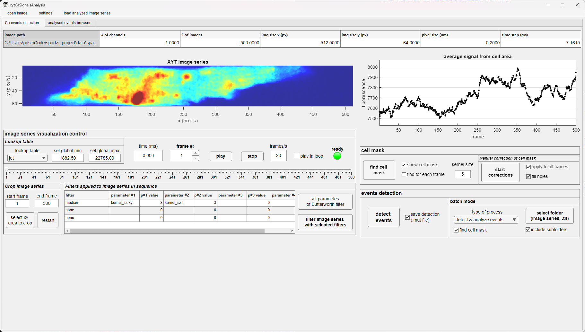

## **xytCalciumSignalsDetection**: Graphical User Interface for Calcium Event Detection 🖥️💡

This repository contains a graphical user interface (GUI) that uses deep learning to detect calcium events in xyt fluorescence image series. Using a deep learning model based on the 3D U-Net architecture [[1]](#1), the GUI makes it easy for researchers to identify and retrieve parameters such as amplitude, FDHM, ... of local calcium release signals, which are crucial for understanding cellular functions or neuronal activity in physiological research.

### Key Features:

- **Advanced Detection**: Utilize a well-established deep learning model to detect calcium events in complex image series.
- **User-Friendly Interface**: GUI designed to streamline the analysis process, making it easily accessible to researchers.

For further details on the methodology and findings, please consult our paper ...

## Table of Contents 📚

- [Introduction](#introduction)
- [Installation](#installation)
- [Usage](#gui-usage)
- [References](#references)
- [Contact](#contact)
- [License](#license)
- [Acknowledgments](#acknowledgments)

## Introduction 🔬🫀

Calcium signaling is a key pathway through which cells respond to external stimuli and communicate with each other. The `xytCalciumSignalsDetection` project provides researchers with efficient tools to analyze and interpret calcium signals from confocal xyt-imaging data.

The model has been trained on confocal imaging data from cardiac myocytes, but it can be adapted with relative ease to other types of cells and tissues. The training code can be found in [this GitHub repository](https://github.com/dottipr/sparks_project).

## Installation

Please note that the application requires Matlab Runtime to run.

For Windows users, download the `MyAppInstaller_web.exe` file from the `Win` directory, execute it, and follow the installation instructions.

## GUI Usage 🖱️🖥️

The GUI was created using Matlab App Designer to function as a standalone application that is compatible with both macOS and Windows. It is designed to simplify the analysis of calcium signals.

### Interface Overview

The menu at the top of the GUI contains three items: 'Open Image', 'Settings', and 'Load Analyzed Image Series'.

#### Settings

The 'Settings' menu offers users various options to customize the analysis:

- **Filter Selection**: Choose filters to apply to the image series in sequence.
- **Default Pixel Size**: Adjust the default pixel size to match the scale of your image series.
- **Deep Learning Model Parameters**: Customize class names and numbering, and specify the path to the conda environment used for detection.

#### Main Features

The GUI is divided into two primary tabs:

1. **Ca Events Detection**: This tab is for identifying calcium events in the image series.
2. **Analyzed Events Browser**: After detecting events, users can review them in the Analyzed Events Browser tab. They can manually adjust and correct fits as needed.

### Typical Workflow

To use the GUI for calcium signal analysis, follow these steps:

1. **Load Image Series**: Start by loading your TIFF image series using the Open File menu option.
2. **Detect Cell Mask**: Automatically detect the cell mask. Manual corrections can be made if necessary.
3. **Detect Calcium Events**: Use the 'Detect Events' button to identify calcium events within your series.
4. **Browse and Correct Events**: Use the Analyzed Events Browser tab to review each detected event. Manually correct fits as necessary to refine the analysis.
5. **Save Results**: Once you are satisfied with the corrections, save the results as an Excel file for further analysis or documentation.

## References

<a id="1">[1]</a>
Özgün Çiçek, Ahmed Abdulkadir, Soeren S. Lienkamp, Thomas Brox, Olaf Ronneberger: 
3D U-Net: Learning Dense Volumetric Segmentation from Sparse Annotation. 
[CoRR abs/1606.06650](https://arxiv.org/abs/1606.06650) (2016)

## Contact

For any queries, please reach out to us at [GitHub Issues](https://github.com/r-janicek/xytCalciumSignalsDetection/issues).

## License

This project is licensed under the MIT License - see the [LICENSE](LICENSE) file for details.

---

[Back to Top](#table-of-contents) 🚀
